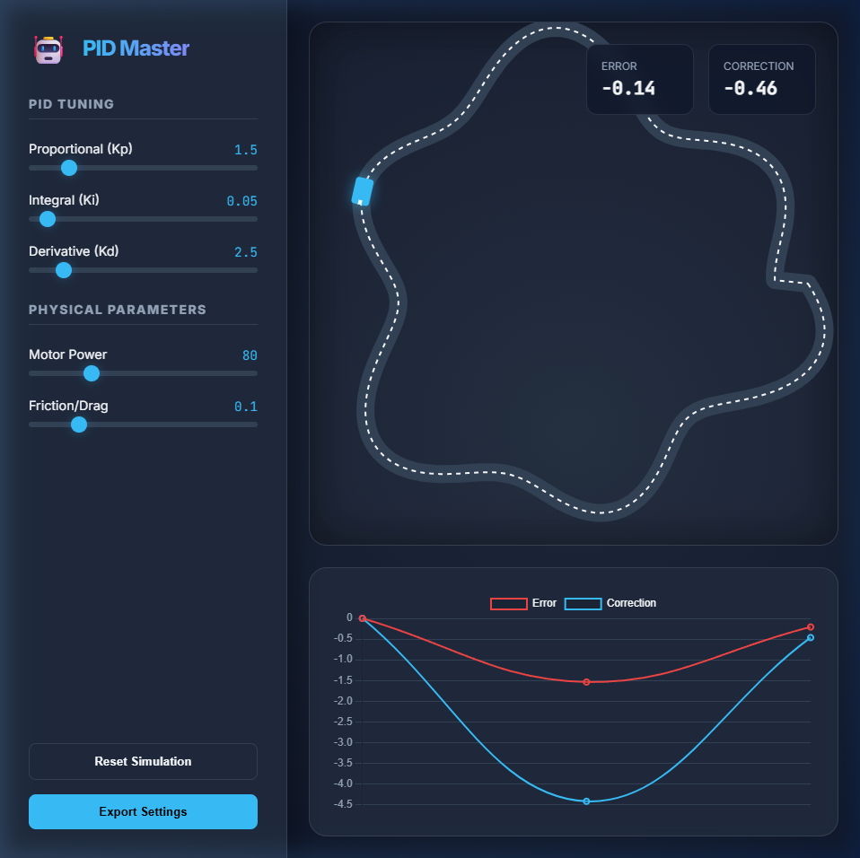

# 🤖 PID Master: Line-Follower Simulator

**PID Master** is a high-fidelity, interactive physics simulator designed to master the art of Proportional-Integral-Derivative (PID) control.

### 🌐 [Live Web Test Dashboard](https://ssj1971.github.io/pid-master-simulator/)
**Try the app directly in your browser!** No installation required.

## ✨ Features

- 🏎️ **Real-time Physics Engine**: Simulates differential steering, momentum, and friction with high precision.
- 📊 **Dynamic Analytics**: Live telemetry charts showing Cross Track Error vs. Correction values.
- 🛠️ **Interactive Tuning**: On-the-fly adjustment of $K_p$, $K_i$, and $K_d$ gains.
- 🎨 **Futuristic Design**: Sleek dark-mode interface with glassmorphism and smooth animations.
- 📦 **Desktop Ready**: Packaged as a standalone Windows application.

## 🚀 Quick Start

1. **Adjust sliders** on the sidebar to tune your robot.
2. **Watch the telemetry** to identify oscillations, overshoot, or steady-state error.
3. **Reset and Stress Test** by changing motor power and drag coefficients.

